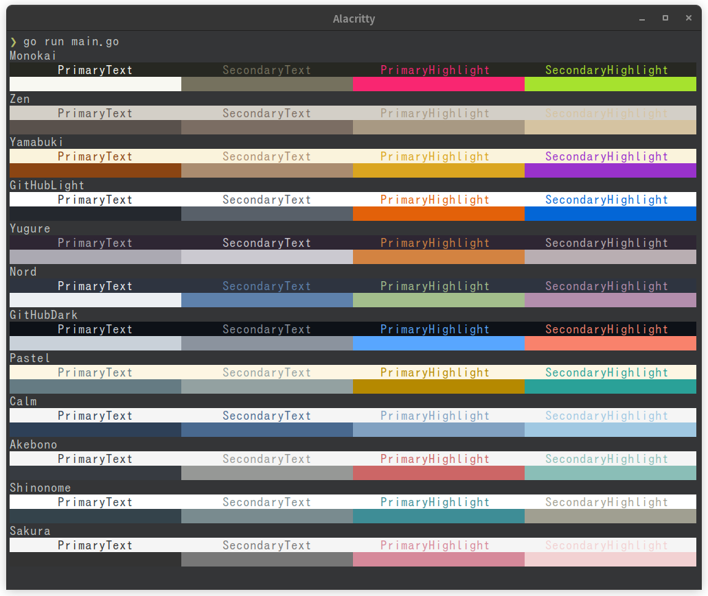

# 🚧【WIP】

<br>
<p align="center">
irodori(彩)
</p>

<p align="center">
<a href="https://opensource.org/licenses/MIT">

</a>
<a href="https://pkg.go.dev/github.com/orangekame3/irodori">

</a>
<a href="https://github.com/orangekame3/irodori/actions/workflows/tagpr.yml">

</a>
</p>

## Color Pallete

```go
package main

import (
    "fmt"

    "github.com/charmbracelet/lipgloss"
    irodori "github.com/oragekame3/irodori"
    )

    func main() {
    for key, theme := range irodori.Pallete {
        styles, bgStyles := irodori.ColorSample(theme)
        fmt.Println(key)
        fmt.Println(lipgloss.JoinHorizontal(lipgloss.Top, styles...))
        fmt.Println(lipgloss.JoinHorizontal(lipgloss.Top, bgStyles...))
    }
}
```

<p align="center">

</p>

## Usage

## License

`irodori` is licensed under the MIT License - see the [LICENSE](./LICENSE) file for details.

## Acknowledgments
